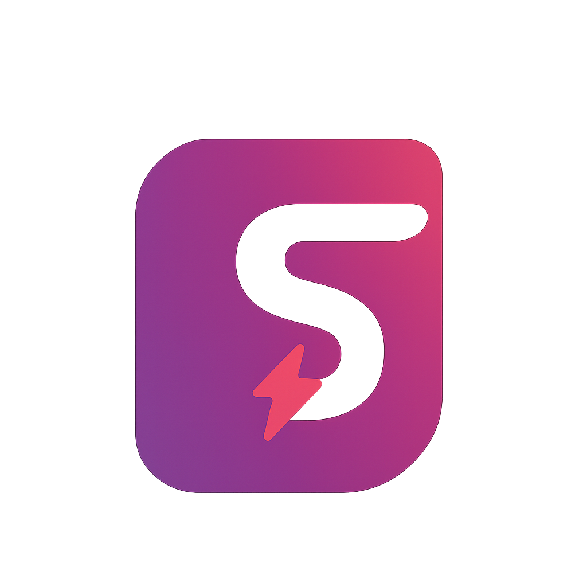
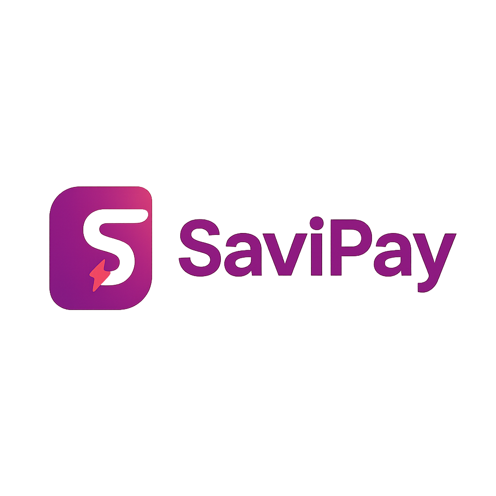

<p align="center">
  
</p>

<h1 align="center">SaviPay 💸</h1>
<p align="center">
  <b>Smart payments for smart people.</b><br/>
  💼 UI-First Fintech • 🎨 Pixel-Perfect Figma Designs • 📲 Built with React Native
</p>

<p align="center">
  <a href="https://github.com/ChinonsoChikelue/savipay/stargazers">
    
  </a>
  <a href="https://github.com/ChinonsoChikelue/savipay/fork">
    
  </a>
  <a href="https://github.com/sponsors/ChinonsoChikelue">
    
  </a>
</p>

---

## 🚀 What is SaviPay?

<p align="center">
  
</p>

**SaviPay** is a UI-centric, mobile-first fintech frontend app — carefully crafted from a stunning Figma design. It lays the visual foundation for a future-ready African financial product with clean UI, mobile responsiveness, and developer-friendly structure.

> "This is more than design. It's fintech reimagined for real users."

---

## 🖼️ Screenshots

<p align="center">
  
  
  
</p>

> Want to see more? Clone the repo and run it live 🚀
---

## 🌟 Features

- 📱 Fully responsive **mobile-first UI**
- 🎨 Built directly from a modern **Figma prototype**
- 🧩 Modular React Native components
- 📦 Scalable folder structure for future backend integration
- 🧠 Clean code, easy customization, and onboarding

---

## 📁 Project Structure

```
SaviPay
├── assets/            # Fonts, images, icons, svgs
├── components/        # Reusable UI components
├── app/               # Main app screens (Home, Send, Invest...)
├── navigation/        # React Navigation setup
├── constants/         # Colors, themes, dummy data
└── App.js             # Entry point
```

---

## 🛠️ Built With

- **React Native** + **Expo**
- **Figma** UI Implementation
- **React Navigation** for seamless routing

---

## 🔧 Getting Started

```bash
# Clone the repo
https://github.com/ChinonsoChikelue/savipay.git
cd savipay

# Install dependencies
npm install

# Run the app
npx expo start
```

---

## 🧠 Why Sponsor This?

Your support will help:
- 💡 Develop backend APIs and database
- 📲 Launch full-stack MVP on Android/iOS
- 🌍 Empower underserved users across Africa

👉 [Sponsor this project](https://github.com/sponsors/ChinonsoChikelue)
💳 Or [Donate via Paystack](https://paystack.com/pay/savipay)

---

## 🤝 Contributing

We love contributions! Start by:
1. Forking the repo
2. Creating a new branch
3. Making your changes
4. Opening a PR 💥

More info in [CONTRIBUTING.md](./CONTRIBUTING.md)

---

## 👨‍💻 Author

**Chinonso Chikelue**  
CEO | Founder | Fullstack Web/App Engineer & Product Thinker  
[@ChinonsoChikelue](https://github.com/ChinonsoChikelue)

---

## 📄 License

MIT License. Use it, remix it, scale it.

---

<p align="center">
  🌍 Built in Africa. Designed for the world.
</p>
